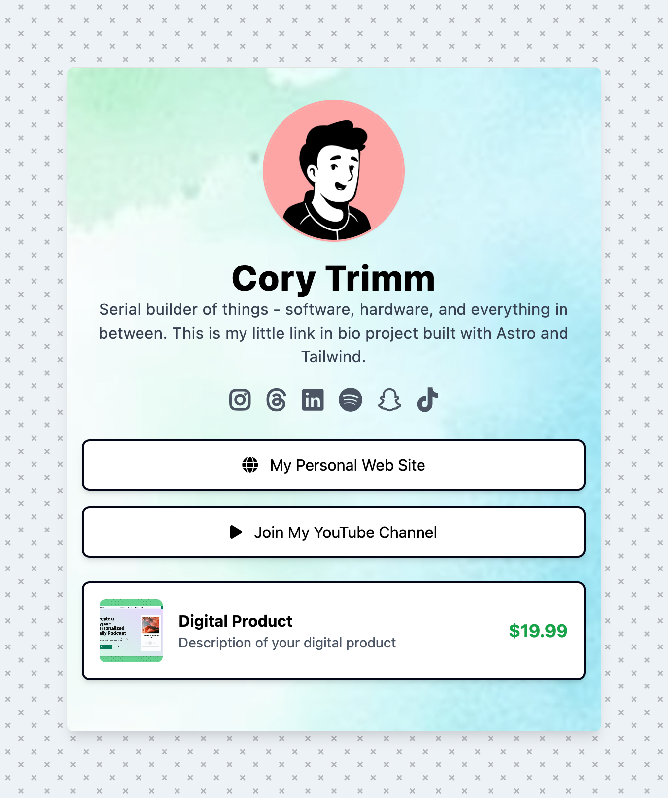

# Link in Bio Astro Theme

This is a customizable Link in Bio theme built with Astro and TailwindCSS.

## Preview

## Getting Started

1. Clone this repository
2. Run `npm install`
3. Run `npm run dev` to start the development server

## Customization

### Updating User Information

To update your information, edit the `config.js` file in the root directory. You can modify the following:

- User details (name, bio, profile image)
- Background color and image
- Social links
- Custom links
- Products

### Changing Profile Photo

1. Add your profile photo to the `/src/images/` directory
2. Update the `profileImage` path in `config.js`

**Note** - You can create a notion like [profile photo here](https://www.avatartion.com/)

### Changing Background

1. To change the background color, update the `background.color` value in `config.js`
2. To use a background image, add the image to `src/images/backgrounds/` and update the `background.image` path in `config.js`

**NOTE** - I've added a few sample background that you can use for free in the `src/images/backgrounds/*` folder.

### Changing Icons

1. Search the [Font Awesome website](https://fontawesome.com/) for a free icon name
2. Update whatever you would like in the `config.js` file

### Ordering Content

The order of links and products is determined by their order in the `config.js` file. To change the order, simply rearrange the items in the `links` and `products` arrays.

## Building for Production

Run `npm run build` to create a production-ready build of your site.

## Deploy

You can deploy this site to any static site hosting platform. We recommend using [Netlify](https://www.netlify.com/) or [Vercel](https://vercel.com/) for easy deployment.
